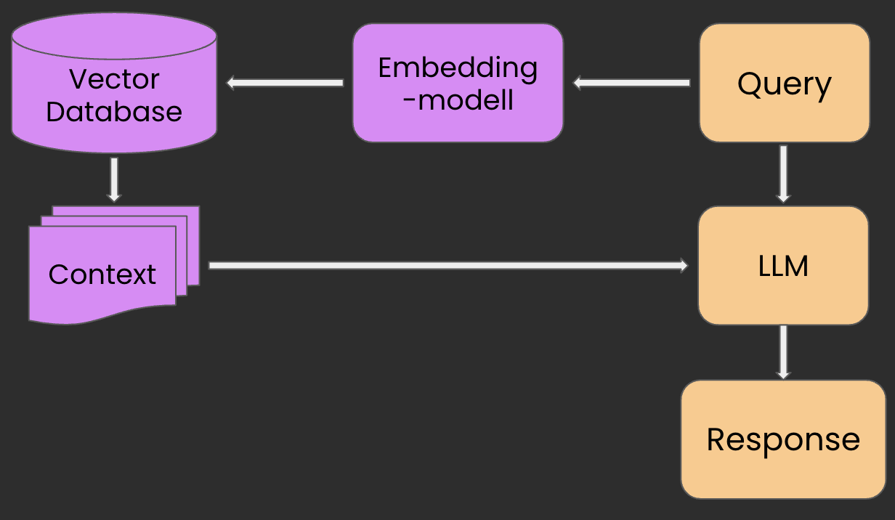

# Retrieval-Augmented Generation for customized chatbots

This repository contains guides and code snippets to exemplify the power of Retreival-Augmented Generation (RAG) in the task of bulding customized chatbots to a low cost. Alot of the logic and operations is explained in the respective notebooks, but this README file will explain the underlying components, how to read the repo, and how to start the system.

## What is RAG?

The main idea of Retrieval Augmented Generation is that we utilize the communicative skills of the state-of-the-art LLMs, but we supply them with context and domain knowledge they do not possess from training.Normally, a chatbot with a pre-trained LLM would progress something like the yellow-isch boxes in the image, just plain query-model-response workflow.

With the new path for the query we introduce:

1. **Embedding model**. Models built on transformers and specialized to convert text to geometrical and numerical representations.
2. **Vector Database** Is where we store all the information that we want to be able to pass to the LLM as _context_. The info is embedded by the same embedding model.
3. **Context** Is the chunks of information from our knowledge base, the _vector database_, that we consider relevant to the specific query at hand. Often, we limit the amount of chunks we pass to the LLM to enhance the quality of responses.

## Why RAG?

- Cheaper than training the entire LLM
- Easy to alter and change behaviour
- Can be modularized and well structured for CI/CD workflows.

For a more extensive walkthrough of RAG, check out this great [blogpost](https://www.rungalileo.io/blog/mastering-rag-how-to-architect-an-enterprise-rag-system)!

## How to read this repo

The code in this repo consists of two Notebooks and one python script:

- `Datascraping.ipynb` shows a nice intro to scraping web info, parsing the text and process it a bit to store it in a suitable manner for NLP tasks.
- `Chroma.ipynb` builds up the RAG infrastructure, persists the vector database, and makes the chatbot ready for being applied.
- `RAG.py` is a script that uses the resulting model and vector space from the final notebook, but now sets up a FastAPI endpoint for you to test the functionality.

## The selected libraries and tools

- We use an embedding model called `mxbai-embed-large-v1`from mixedbread AI. It came in march of 2024 of something, I tried it and it crushed the performance of models several times its size. Including BGE Large.
- We use `Lanchaing Document` datastructure to represent data in a way suitable for NLP tasks. Referring to their documentation for further explanation than what I give in the notebooks.
- We use `Chroma DB` as our vector database provider. This is probably the most complex module in this little demo-repo. You do not need full understanding of the Chroma DB open source infrastructure in order to use it with good results, but I recommmend glancing at their own documentaion [here](https://docs.trychroma.com/)

## SETUP

1. Create a virtual environment, either python or conda or whatever you fancy. I'll go `python3.11 -m venv venv`
   and then `source venv/bin/activate` in the root of this repo to set up mine. Not necessary to go with python 3.11, but I recommend doing so in order to make sure package versions etc are compatible.
2. run `pip3 install -r requirements.txt` to get the correct version of any package or library.
3. In order to see the resulting chatbot, you must create a .env file with a OpenAI API key. Create one, copy it and insert it in your .env file like this: `OPENAI_KEY=<your key here>`

4. After that, you can start working your way through the first notebook. You should realize that this version of the repo already has the finished `data.json` file.
5. When starting on the second notebook, pay attention to the there described difference of persisting a Chroma DB from memory and constructing it from documents. This repo already has the finalized Chroma Collection, but I recommend you later delete that (the folder called **e5_ml_d** is the chroma collection) folder and persist it yourself. But nothing wrong in just clicking through the notebooks and run everything first!

6. Finally, you are ready to run `python3 RAG.py` in order to fire up the script and the API endpoint locally.

### Further work

This script that runs the RAG chain can be deployed using a docker volume in a docker container. Then you just host it as any other API endpoint in some cloud environment.

The embedding models can be quite easily fine-tuned towards domain specific data, which enhances performance. I decided not to include fine-tuning in this repo since the models keep accelerating in terms of out of the box quality, and we need little alteration to achieve a nice performance.

For those interested in fine-tuning, check out how it is done via Sentence Transformers and Flag Embeddings web documentation.
